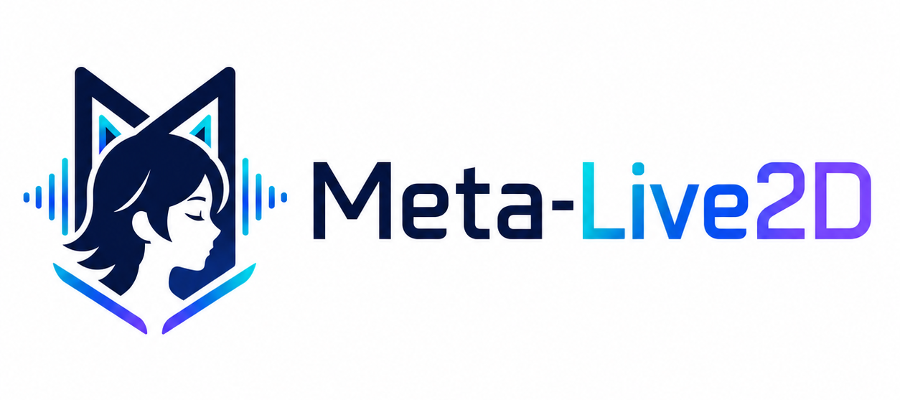
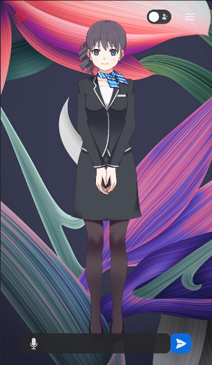
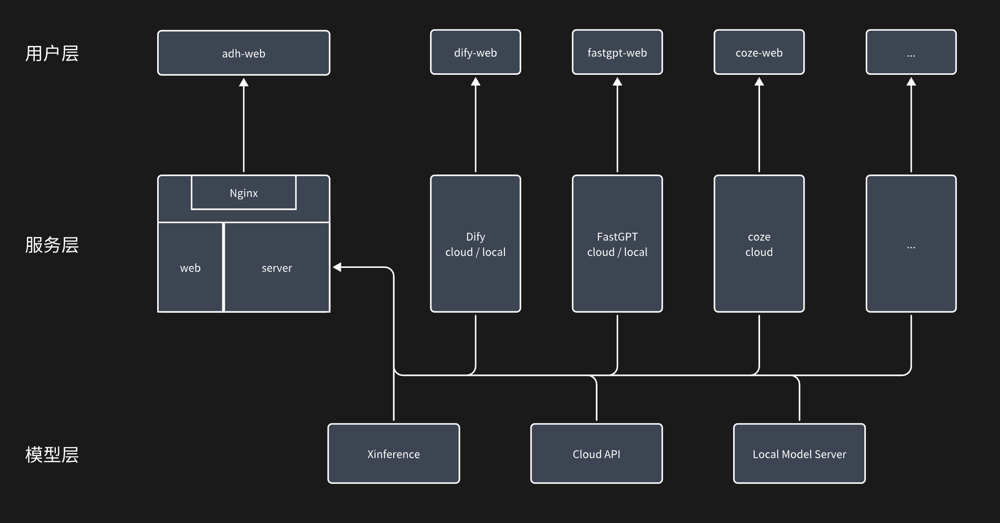

<div align="center">
  
  <p>基于 FastAPI + Next.js 的 Live2D 数字人交互平台，支持 ASR / TTS / Vision / Agent 模块化接入。</p>

  <p>
    
    
    
    
    
    
  </p>

  <p>
    <a href="#快速开始">快速开始</a> ·
    <a href="./docs/deploy_instrction.md">部署文档</a> ·
    <a href="./docs/developer_instrction.md">开发文档</a> ·
    <a href="./docs/Q&A.md">常见问题</a>
  </p>
</div>

## 项目简介

Meta-Live2D 是一个面向 Web 的数字人交互项目，提供 Live2D 角色展示、文本/语音对话、视觉能力接入，以及面向 Dify、FastGPT、Coze、OpenAI Compatible 等服务的 Agent 扩展能力。

项目采用前后端分离架构：

- 后端使用 FastAPI 提供 REST API 与 WebSocket 能力，服务入口在 `main.py`，接口统一挂载在 `/adh` 前缀下。
- 前端使用 Next.js 15 构建，产品页入口位于 `web/app/(products)/sentio`。
- 引擎与 Agent 通过配置和注册机制组织，便于替换 ASR、TTS、Vision 和上层业务编排。

## 界面预览

| Desktop | Mobile |
| --- | --- |
|  |  |

## 核心能力

- Live2D 数字人展示与交互，支持桌面端与移动端访问。
- 语音链路支持实时/流式交互，可接入 ASR 与 TTS。
- Agent 层支持 OpenAI Compatible、Dify、FastGPT、Coze 等外部服务。
- Vision 模块支持人脸/唇形检测与 OpenCV 人脸检测能力。
- 支持 Docker 快速体验，也支持本地源码开发与自定义扩展。
- 支持在浏览器内临时注册自定义 Live2D 角色，并持久化到本地浏览器存储。

## 能力矩阵

| 模块 | 当前仓库内可用配置 |
| --- | --- |
| Agent | `repeaterAgent`、`openaiAPI`、`difyAgent`、`fastgptAgent`、`cozeAgent` |
| ASR | `difyAPI`、`cozeAPI`、`tencentAPI`、`funasrStreamingAPI` |
| TTS | `edgeAPI`、`tencentAPI`、`difyAPI`、`cozeAPI` |
| Vision | `faceLipDetector`、`opencvFaceDetector` |

相关配置文件位于 [`configs/`](./configs/) 目录，默认启用项可在 [`configs/config.yaml`](./configs/config.yaml) 中调整。

## 架构概览



整体调用链可以概括为：

1. 用户通过 Next.js 前端进入 Sentio 页面，与 Live2D 角色进行文本或语音交互。
2. 前端将请求发送到 FastAPI 服务，后端通过 `/adh` 前缀下的 API 与 WebSocket 路由处理业务。
3. 后端根据 `configs/config.yaml` 加载引擎池与 Agent 池，选择对应的 ASR、TTS、Vision 与 Agent 实现。
4. Agent 可以继续转发到 Dify、FastGPT、Coze 或 OpenAI Compatible 服务，形成完整对话链路。

## 快速开始

### 方式一：Docker 快速体验

该方式直接使用预构建镜像，适合快速拉起完整体验环境。

```bash
git clone https://github.com/skygazer42/meta-live2d.git
cd meta-live2d
docker compose -f docker-compose-quickStart.yaml up -d
```

启动后访问：

- `http://localhost:8880`

### 方式二：本地源码开发

适合调试后端、前端页面和各类自定义引擎。

#### 1. 启动后端

```bash
git clone https://github.com/skygazer42/meta-live2d.git
cd meta-live2d
pip install -r requirements.txt
sudo apt install ffmpeg
python main.py
```

默认后端地址：

- `http://127.0.0.1:8880`

#### 2. 启动前端

```bash
cd web
npm install -g pnpm
pnpm install
pnpm dev
```

默认前端地址：

- `http://127.0.0.1:3000`

如果需要生产模式，可执行：

```bash
cd web
pnpm build
pnpm start
```

## 配置说明

### 后端配置

- 全局配置文件：[`configs/config.yaml`](./configs/config.yaml)
- Agent 配置目录：[`configs/agents/`](./configs/agents/)
- 引擎配置目录：[`configs/engines/`](./configs/engines/)
- 模板文件：[`configs/config_template.yaml`](./configs/config_template.yaml)

默认配置中：

- 后端服务监听 `0.0.0.0:8880`
- API 前缀为 `/adh`
- Agent 默认值为 `repeaterAgent.yaml`

### 前端配置

前端运行参数位于 [`web/.env`](./web/.env)：

```env
NEXT_PUBLIC_SERVER_IP="127.0.0.1"
NEXT_PUBLIC_SERVER_PROTOCOL="http"
NEXT_PUBLIC_SERVER_PORT="8880"
NEXT_PUBLIC_SERVER_VERSION="v0"
NEXT_PUBLIC_SERVER_MODE="prod"
```

如果修改服务端口，需要同步更新 Docker 端口映射以及 `web/.env` 中的后端地址。

## 自定义 Live2D 角色

前端支持在浏览器中临时注册自定义角色，入口位于 `Sentio -> 模型/画廊`。如果希望把角色做成项目内置资源，建议放到以下目录：

```text
web/public/sentio/characters/custom/<ModelName>/
```

常见资源命名约定：

- 压缩包：`<ModelName>.zip`
- 解压目录：`<ModelName>/`
- 预览图：`<ModelName>.png`
- 模型入口：`<ModelName>.model3.json`

如果要让角色出现在默认列表中，还需要同步修改 [`web/lib/constants.ts`](./web/lib/constants.ts) 中对应的角色数组。更完整的替换流程可参考 [`docs/developer_instrction.md`](./docs/developer_instrction.md)。

## 项目结构

```text
.
├── main.py                         # 后端启动入口
├── digitalHuman/                   # FastAPI 服务、引擎池、Agent 池与核心逻辑
├── web/                            # Next.js 前端与 Live2D 页面
├── configs/                        # 全局配置、Agent 配置、引擎配置
├── docker/                         # Dockerfile、Nginx 与相关资源
├── docs/                           # 部署、开发、协议、Q&A 等文档
├── assets/                         # 架构图、截图与说明图片
└── test/                           # API / WebSocket / 回归测试脚本
```

## 测试

后端测试与调试脚本位于 [`test/`](./test/)，前端资源校验测试位于 [`web/tests/regression.test.mjs`](./web/tests/regression.test.mjs)。

常用命令：

```bash
# 后端测试
pytest

# 前端资源回归检查
node --test web/tests/regression.test.mjs
```

更多测试说明见 [`test/README.md`](./test/README.md)。

## 文档索引

- [部署文档](./docs/deploy_instrction.md)
- [开发文档](./docs/developer_instrction.md)
- [流式协议说明](./docs/streaming_protocol.md)
- [常见问题 Q&A](./docs/Q&A.md)

## Roadmap

- [ ] RTC 音视频流支持
- [x] 跨模态交互（麦克风 / 摄像头）
- [ ] AI 生成 Live2D 人物模型
- [ ] 基于情感的人物表情 / 动作驱动

## 致谢

- [Dify](https://github.com/langgenius/dify)
- [Live2D Cubism SDK](https://github.com/Live2D)
- [FunASR](https://github.com/modelscope/FunASR)

## License

本项目基于 [Apache-2.0 License](./LICENSE) 开源。
