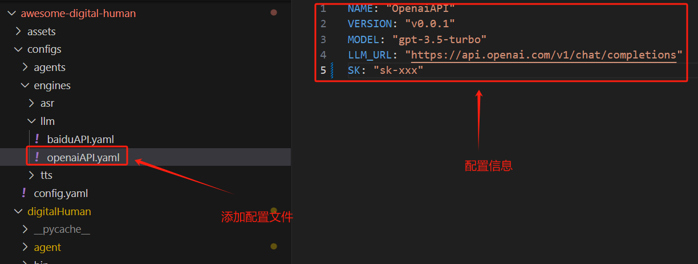
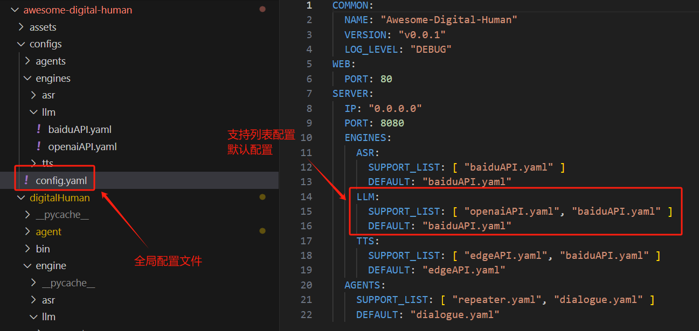
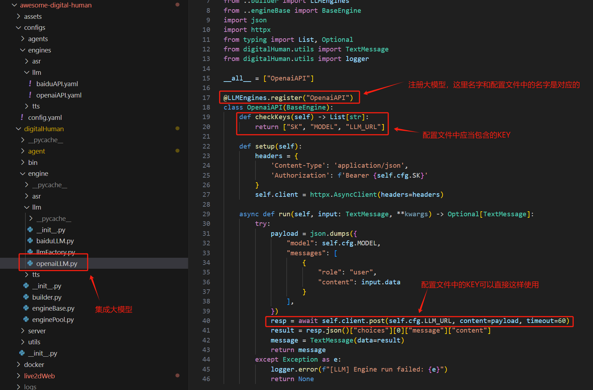
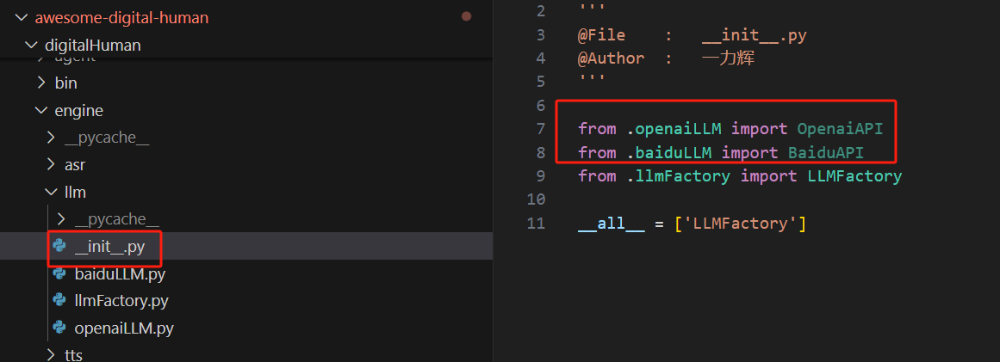
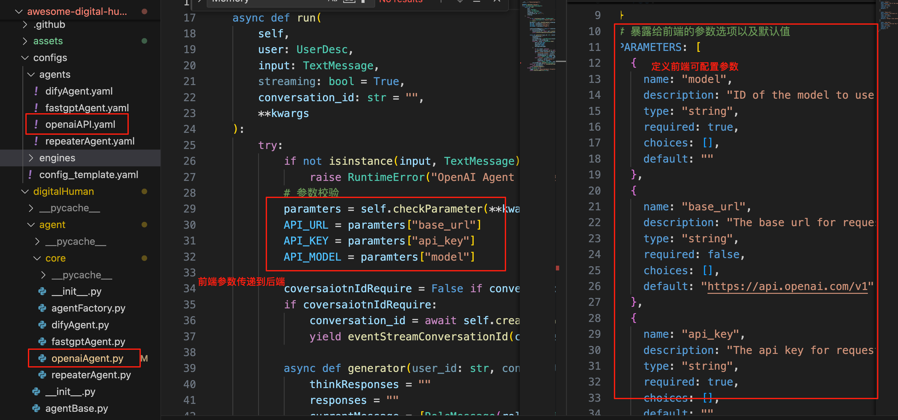

## meta-live2d 开发指南

### 配置文件说明
由于扩展的多样性，通过一个全局的配置文件管理各个模块的子配置文件    
配置文件的目录结构如下:  
```bash
.
├── config.yaml                  # 全局配置文件
├── agents                       # agent 配置文件目录
└── engines                      # 引擎配置文件目录
    ├── asr                      # 语音识别引擎配置文件目录
    ├── llm                      # 大模型引擎配置文件目录
    └── tts                      # 文字转语音引擎配置目录
```
[全局配置](configs/config.yaml)文件中的内容如下:  
```yaml
COMMON:                                 # 通用配置项
  NAME: "meta-live2d"                   # 名字
  VERSION: "v3.0.0"                     # 版本
  LOG_LEVEL: "DEBUG"                    # 日志等级
SERVER:                                 # 服务配置项
  IP: "0.0.0.0"                         # 服务启动IP
  PORT: 8000                            # 服务启动端口
  ENGINES:                              # 引擎配置项
    ASR:                                # 语音识别配置项
      SUPPORT_LIST: [ "xxx.yaml" ]      # 支持的语音识别列表(这些配置文件应当在configs/engines/asr目录下)
      DEFAULT: "xxx.yaml"               # 默认使用的语音识别配置
    LLM:                                # 大模型配置项(不需要配置, 预留模块)
      SUPPORT_LIST: [ "" ]              # 支持的大模型列表(这些配置文件应当在configs/engines/llm目录下)
      DEFAULT: ""                       # 默认使用的大模型配置
    TTS:                                # 文字转语音配置项
      SUPPORT_LIST: [ "xxx.yaml" ]      # 支持的文字转语音列表(这些配置文件应当在configs/engines/tts目录下)
      DEFAULT: "xxx.yaml"               # 默认使用的文字转语音配置
  AGENTS:                               # Agent 配置项目
    SUPPORT_LIST: [ "xxx.yaml" ]        # 支持的Agent列表(这些配置文件应当在configs/agents目录下)
    DEFAULT: "xxx.yaml"                 # 默认使用的Agent配置
```

### 定制化开发
#### 人物模型
* 需要live2d支持的模型👉[skygazer42](https://github.com/skygazer42)
* 人物模型控制使用 [live2d web SDK](https://www.live2d.com/en/sdk/about/)  
* 项目开源人物模型均来自 [live2d官方免费素材](https://www.live2d.com/zh-CHS/learn/sample/)   

添加人物模型到`meta-live2d/web/public/sentio/characters`目录下并在`meta-live2d/web/lib/constants.ts`中修改字段`SENTIO_CHARACTER_IP_MODELS`、`SENTIO_CHARACTER_CUSTOM_MODELS`或`SENTIO_CHARACTER_FREE_MODELS`添加人物模型名称即可。注册到列表里的模型必须已经有完整静态资源，否则画廊可以显示但运行时无法加载。
人物模型规则参考[skygazer42](https://github.com/skygazer42)中的画廊自定义人物部分。

##### Live2D 人物替换完整流程
1. 准备 Cubism 导出的运行时文件，至少包含 `.model3.json`、`.moc3` 和贴图目录；如果模型使用物理、姿势、表情、动作或用户数据，也要同时保留 `.physics3.json`、`.pose3.json`、`.exp3.json`、`.motion3.json`、`.userdata3.json` 等文件。
2. 选择模型归属目录：
   - 免费模型：`web/public/sentio/characters/free/<ModelName>`
   - 定制模型：`web/public/sentio/characters/custom/<ModelName>`
   - IP 模型：`web/public/sentio/characters/ip/<ModelName>`
3. 保持目录名、预览图名、模型配置名一致。示例：
   ```text
   web/public/sentio/characters/custom/<ModelName>/
   ├── <ModelName>.png
   ├── <ModelName>.model3.json
   ├── <ModelName>.moc3
   ├── <ModelName>.physics3.json
   ├── expressions/
   ├── motions/
   └── <texture-dir>/
   ```
   前端画廊使用`<ModelName>.png`作为预览图，Live2D 加载器使用`<ModelName>.model3.json`作为入口文件。
4. 检查`<ModelName>.model3.json`里的所有相对路径。`Moc`、`Textures`、`Physics`、`Pose`、`Expressions[].File`、`Motions.*[].File`、`UserData`都必须指向同一模型目录下真实存在的文件，并且大小写要和文件名完全一致。
5. 在`web/lib/constants.ts`注册模型名：
   ```ts
   export const SENTIO_CHARACTER_CUSTOM_MODELS: string[] = ["<ModelName>"]
   ```
   如果要设为默认人物，同时把`SENTIO_CHARACTER_DEFAULT`改为`"<ModelName>"`，并确保`SENTIO_CHARACTER_DEFAULT_PORTRAIT`所在分类路径与模型归属目录一致；如果默认人物不是 free 分类，需要同步调整默认画像路径和`useAppConfig`里的默认`resource_id`生成逻辑。
6. 如果后端嵌入配置要默认使用新人物，修改`configs/apps/sentio_apps.json`中的`character`：
   ```json
   {
     "resource_id": "CUSTOM_<ModelName>",
     "name": "<ModelName>",
     "type": "character",
     "link": "/sentio/characters/custom/<ModelName>/<ModelName>.png"
   }
   ```
7. 运行校验：
   ```bash
   node --test web/tests/regression.test.mjs
   ```
   这个回归测试会检查已注册模型目录、`<ModelName>.png`、`<ModelName>.model3.json`以及`.model3.json`引用的运行时文件是否存在。
8. 启动前端后，在画廊切换到对应分类点击人物。切换链路是`gallery.tsx -> useLive2D().setLive2dCharacter -> Live2dManager.changeCharacter -> LAppDelegate.changeCharacter -> LAppLive2DManager.changeCharacter -> LAppModel.loadAssets`，因此画廊预览图路径所在目录就是 Live2D 运行时查找`.model3.json`和相关资源的目录。
#### 背景图片
添加图片到`meta-live2d/web/public/sentio/backgrounds`目录下并在`meta-live2d/web/lib/constants.ts`中修改字段`SENTIO_BACKGROUND_STATIC_IMAGES`或`SENTIO_BACKGROUND_DYNAMIC_IMAGES`添加图片名称即可
#### 后端模块扩展
（后端引擎均通过注册的方式，asr、llm、tts、agent方式相同）
##### 常规引擎  
对于asr、llm、tts的扩展实现在`digitalHuman/engine`目录下，也可以依葫芦画瓢扩展更多的引擎，以扩展openai大模型为例（这里只是作为一个示例，使用difyAgent后并不会再使用llm engine）:  
* 新增llm配置文件  

* 全局配置文件支持新增的llm  

* llm推理实现并注册  

* 模块入口函数引用(动态注册的方式，需要被import一下)  

##### agent
对于agent的扩展实现在`digitalHuman/agent/core`目录下，扩展方式和常规引擎相同，这里的agent可以使用上面的常规引擎自己构建，也可以接入像dify这样的编排框架平台  
唯一不同点在于agent需要向前端暴露参数，可以通过在配置文件中暴露参数，前端根据暴露的参数渲染，同时会使用这设置的默认值  

